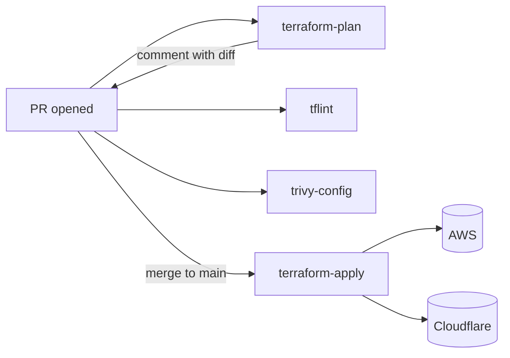
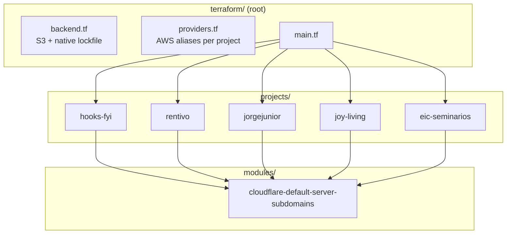

# infra-resources

> Terraform-managed infrastructure for the `jorgejr568` ecosystem (AWS + Cloudflare DNS), applied via GitHub Actions.

[](https://github.com/jorgejr568/infra-resources/actions/workflows/terraform-apply.yml)
[](LICENSE)
[](.tool-versions)

> Full documentation lives in [`docs/ARCHITECTURE.md`](docs/ARCHITECTURE.md). This README is a quick-start.

## Architecture at a glance

PR → plan → review → merge → apply:



One root module composes per-project child modules; a shared primitive module emits the proxied A/AAAA pair used across projects:



## Quick start

1. **Bootstrap the state backend (one-time, per AWS account):**
   ```bash
   ./scripts/bootstrap-backend.sh
   ```
2. **Configure GitHub secrets:**
   - `AWS_ACCESS_KEY_ID`
   - `AWS_SECRET_ACCESS_KEY`
   - `CLOUDFLARE_API_TOKEN`
   - `SERVER_IPV4`, `SERVER_IPV6` — origin server IPs sitting behind the Cloudflare proxy (must be secrets, not variables — leaking them allows attackers to bypass the Cloudflare WAF/DDoS and hit the origin directly)
   - `CLOUDFLARE_ACCOUNT_ID` — Cloudflare account ID (account-scoped resources like Turnstile)
4. **Push to `main`** — the apply workflow runs automatically.
5. **For changes thereafter**, open a PR. The plan workflow comments the diff. Merge to apply.

## Local development

Optional but recommended: install [pre-commit](https://pre-commit.com) so fmt/validate/tflint run on every commit.

```bash
brew install pre-commit
pre-commit install
```

The same checks (`terraform_fmt`, `terraform_validate`, `tflint`) plus a Trivy config scan run in CI on every PR.

## Layout

- `terraform/projects/<project>/` — one Terraform child module per project. Projects: `eic-seminarios`, `hooks-fyi`, `jorgejunior` (jorgejunior.dev + j-jr.app), `joy-living`, `rentivo`.
- `terraform/modules/` — shared primitive modules (currently `cloudflare-default-server-subdomains`).
- `terraform/` — root module: `main.tf`, `providers.tf`, `versions.tf`, `backend.tf`, `outputs.tf`, `variables.tf`. One state for everything.
- `.github/workflows/` — `pr-checks.yml` (PR), `terraform-apply.yml` (main).
- `scripts/` — operational scripts (state backend bootstrap).
- `docs/` — architecture and decision docs, plus implementation plans under `docs/superpowers/plans/`.

## License

[MIT](LICENSE) — © 2026 Jorge Junior.

## Contributing

See [CONTRIBUTING.md](CONTRIBUTING.md). For security reports, see [SECURITY.md](SECURITY.md).
