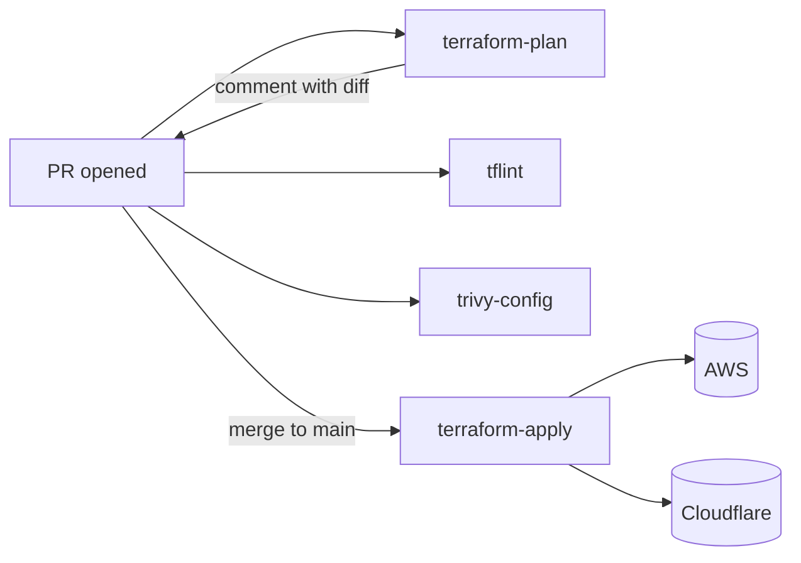
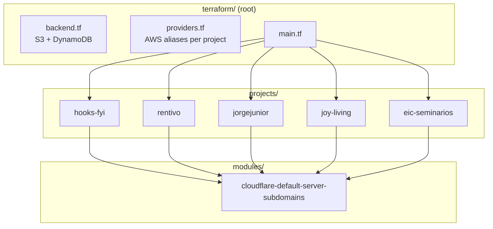

# Public-Repo Prep Implementation Plan

> **For agentic workers:** REQUIRED SUB-SKILL: Use superpowers:subagent-driven-development (recommended) or superpowers:executing-plans to implement this plan task-by-task. Steps use checkbox (`- [ ]`) syntax for tracking.

**Goal:** Add the LICENSE, SECURITY.md, CONTRIBUTING.md, README polish (badges + Mermaid), and audit historical planning docs so the repo is safe and presentable to flip public.

**Architecture:** Six sequenced PRs (PR-0 docs + PR A–E content). All changes are docs/policy — no terraform, no workflow, no infrastructure changes. Every PR's CI must show no terraform plan changes (jobs skip via paths-filter on docs-only PRs).

**Tech Stack:** Markdown, Mermaid (rendered natively by GitHub), shields.io badges. No runtime dependencies.

**Spec:** `docs/superpowers/specs/2026-05-02-public-repo-prep-design.md`

---

## File map

**Created:**
- `LICENSE` — MIT license text, copyright `2026 Jorge Junior`.
- `SECURITY.md` — vulnerability reporting policy.
- `CONTRIBUTING.md` — contribution workflow (fork → PR → CI → merge).

**Modified:**
- `README.md` — tagline, three badges, "Architecture at a glance" section with two Mermaid diagrams.
- `docs/superpowers/plans/2026-04-29-aws-resources-bootstrap.md` — only if audit finds sensitive content.
- `docs/superpowers/plans/2026-04-30-cutover-runbook.md` — same.
- `docs/superpowers/plans/2026-04-30-port-cloudflare-to-terraform.md` — same.
- `docs/superpowers/plans/2026-05-02-polish-repo.md` — same.

**Branch already in flight:**
- `polish/08-public-repo-spec` — has the spec commit; the plan commit lands on top, then PR-0.

---

## PR-0 — Land spec + plan (Tasks 1–2)

### Task 1: Add the implementation plan to `polish/08-public-repo-spec`

**Files:**
- Created earlier in branch flow: `docs/superpowers/plans/2026-05-02-public-repo-prep.md` (this file).

- [ ] **Step 1: Verify branch state**

Run:

```bash
git status
git log --oneline -3
```

Expected: on `polish/08-public-repo-spec`; latest commit is the spec.

- [ ] **Step 2: Stage and commit the plan**

```bash
git add docs/superpowers/plans/2026-05-02-public-repo-prep.md
git commit -m "$(cat <<'EOF'
docs(plan): public-repo prep implementation plan

Lands alongside the spec. Sequences six PRs: docs (this PR-0),
LICENSE, SECURITY, CONTRIBUTING, README polish, and a planning-
docs audit pass.

Co-Authored-By: Claude Opus 4.7 (1M context) <noreply@anthropic.com>
EOF
)"
```

---

### Task 2: Push branch, open PR-0, pause for merge

- [ ] **Step 1: Push and open PR**

```bash
git push -u origin polish/08-public-repo-spec
gh pr create --title "docs: spec and plan for public-repo prep" --body "$(cat <<'EOF'
## Summary
Lands the brainstorming spec and implementation plan for public-repo prep.

- \`docs/superpowers/specs/2026-05-02-public-repo-prep-design.md\` — design covering LICENSE (MIT), SECURITY.md, CONTRIBUTING.md, README polish (badges + Mermaid), and audit of existing planning docs.
- \`docs/superpowers/plans/2026-05-02-public-repo-prep.md\` — 5-PR sequenced plan (PR A–E).

No terraform or infrastructure changes in this series.

## Test plan
- [ ] CI \`plan\` aggregator passes (terraform jobs skip via paths-filter)

🤖 Generated with [Claude Code](https://claude.com/claude-code)
EOF
)"
```

- [ ] **Step 2: Wait for CI and merge**

Run:

```bash
gh pr checks --watch
```

Expected: `plan` aggregator passes (jobs skip on docs-only changes).

Pause: maintainer merges manually.

---

## PR A — LICENSE (Task 3)

### Task 3: Create LICENSE (MIT) and ship it

**Files:**
- Create: `LICENSE`

- [ ] **Step 1: Branch off updated main**

```bash
git checkout main
git pull --ff-only
git checkout -b public-prep/01-license
```

- [ ] **Step 2: Write `LICENSE`**

Create `LICENSE` with the standard MIT text:

```
MIT License

Copyright (c) 2026 Jorge Junior

Permission is hereby granted, free of charge, to any person obtaining a copy
of this software and associated documentation files (the "Software"), to deal
in the Software without restriction, including without limitation the rights
to use, copy, modify, merge, publish, distribute, sublicense, and/or sell
copies of the Software, and to permit persons to whom the Software is
furnished to do so, subject to the following conditions:

The above copyright notice and this permission notice shall be included in all
copies or substantial portions of the Software.

THE SOFTWARE IS PROVIDED "AS IS", WITHOUT WARRANTY OF ANY KIND, EXPRESS OR
IMPLIED, INCLUDING BUT NOT LIMITED TO THE WARRANTIES OF MERCHANTABILITY,
FITNESS FOR A PARTICULAR PURPOSE AND NONINFRINGEMENT. IN NO EVENT SHALL THE
AUTHORS OR COPYRIGHT HOLDERS BE LIABLE FOR ANY CLAIM, DAMAGES OR OTHER
LIABILITY, WHETHER IN AN ACTION OF CONTRACT, TORT OR OTHERWISE, ARISING FROM,
OUT OF OR IN CONNECTION WITH THE SOFTWARE OR THE USE OR OTHER DEALINGS IN THE
SOFTWARE.
```

- [ ] **Step 3: Commit**

```bash
git add LICENSE
git commit -m "$(cat <<'EOF'
docs: add MIT LICENSE

Co-Authored-By: Claude Opus 4.7 (1M context) <noreply@anthropic.com>
EOF
)"
```

- [ ] **Step 4: Push, open PR, pause for merge**

```bash
git push -u origin public-prep/01-license
gh pr create --title "docs: add MIT LICENSE" --body "$(cat <<'EOF'
## Summary
Adds a standard MIT LICENSE, copyright 2026 Jorge Junior. Required before flipping repo public.

Spec: \`docs/superpowers/specs/2026-05-02-public-repo-prep-design.md\` (PR A of E)

## Test plan
- [ ] GitHub auto-detects the LICENSE on the repo home page (visible after merge)
- [ ] CI \`plan\` aggregator passes

🤖 Generated with [Claude Code](https://claude.com/claude-code)
EOF
)"
gh pr checks --watch
```

Pause for merge.

---

## PR B — SECURITY.md (Task 4)

### Task 4: Create SECURITY.md

**Files:**
- Create: `SECURITY.md`

- [ ] **Step 1: Branch off updated main**

```bash
git checkout main
git pull --ff-only
git checkout -b public-prep/02-security
```

- [ ] **Step 2: Write `SECURITY.md`**

Create `SECURITY.md` with this content:

```markdown
# Security policy

## In scope

This policy covers the contents of this repository:

- Terraform configuration (`terraform/`)
- GitHub Actions workflows (`.github/workflows/`)
- Operational scripts (`scripts/`)

## Not in scope

The deployed services managed by this repo (e.g. `hooks.fyi`, `rentivo.com.br`, `joyliving.com.br`, `jorgejunior.dev`, `j-jr.app`, `eic-seminarios.com`) are **separate products** owned by their respective project teams. Security reports about those services should go to those owners directly, not here.

## How to report a vulnerability

1. **Preferred:** open a [private security advisory](https://github.com/jorgejr568/infra-resources/security/advisories/new) on this repository.
2. **Fallback:** email the maintainer at the address in the repo's `git log`. Include `[security]` in the subject line.

Please do **not** open public issues for security bugs.

## What to expect

- **Acknowledgement:** within 7 days.
- **Triage and decision:** within 30 days. Either a fix, a mitigation plan, or a documented rationale for declining.

This is a personal infrastructure repository. There is no funded bug-bounty programme; reports are handled best-effort.

## Examples of valid security findings

- A secret (AWS key, Cloudflare token, etc.) committed to this repo's history.
- An IAM policy in `terraform/projects/*/iam.tf` granting more access than the comment / sid implies.
- An S3 bucket configuration that exposes objects publicly.
- A GitHub Actions workflow vulnerable to script injection (e.g. interpolating untrusted PR titles into `run:` blocks).
- A vulnerable version of a third-party action used by `pr-checks.yml` or `terraform-apply.yml`.
- A vulnerable Terraform provider version that affects this repo's resources.

## Not security findings

- Code-quality concerns (open a regular issue or PR).
- Cosmetic or naming preferences.
- Findings about a service running at one of the listed domains (report to that service's owner).
- Generic "you should use OIDC instead of access keys" — already tracked as future work in `docs/ARCHITECTURE.md`. PRs welcome.
```

- [ ] **Step 3: Commit**

```bash
git add SECURITY.md
git commit -m "$(cat <<'EOF'
docs: add SECURITY.md (vulnerability reporting policy)

Co-Authored-By: Claude Opus 4.7 (1M context) <noreply@anthropic.com>
EOF
)"
```

- [ ] **Step 4: Push, open PR, pause for merge**

```bash
git push -u origin public-prep/02-security
gh pr create --title "docs: add SECURITY.md" --body "$(cat <<'EOF'
## Summary
Adds a vulnerability-reporting policy describing in-scope code, the GitHub private-security-advisory channel, an email fallback, and reasonable response expectations.

> Action item for the maintainer before flipping the repo public: enable GitHub private security advisories under Settings → Security → Vulnerability reporting.

Spec: \`docs/superpowers/specs/2026-05-02-public-repo-prep-design.md\` (PR B of E)

## Test plan
- [ ] CI \`plan\` aggregator passes
- [ ] After merge, GitHub renders \`SECURITY.md\` on the repo's Security tab

🤖 Generated with [Claude Code](https://claude.com/claude-code)
EOF
)"
gh pr checks --watch
```

Pause for merge.

---

## PR C — CONTRIBUTING.md (Task 5)

### Task 5: Create CONTRIBUTING.md

**Files:**
- Create: `CONTRIBUTING.md`

- [ ] **Step 1: Branch off updated main**

```bash
git checkout main
git pull --ff-only
git checkout -b public-prep/03-contributing
```

- [ ] **Step 2: Write `CONTRIBUTING.md`**

Create `CONTRIBUTING.md` with this content:

```markdown
# Contributing

Thanks for considering a contribution. This is a personal infra repo — most changes will come from the maintainer, but bug fixes and improvements are welcome.

## Before you start

- Install [pre-commit](https://pre-commit.com) and run `pre-commit install` once. The pre-commit config (`.pre-commit-config.yaml`) wires up the same `terraform_fmt`, `terraform_validate`, and `tflint` checks that run in CI.
- Use Terraform `1.10.5` locally (matches `.tool-versions`). If you don't have it, the easiest path is Docker:
  ```bash
  docker run --rm -v "$PWD":/work -w /work/terraform hashicorp/terraform:1.10.5 fmt -check -recursive
  ```

## Workflow

1. Fork the repo on GitHub.
2. Branch from `main`.
3. Make your change. Stay inside `terraform/` (and/or `.github/workflows/`) — README, ARCHITECTURE, scripts, and policy files are also fair game.
4. Run locally:
   ```bash
   cd terraform
   terraform fmt -recursive
   terraform validate     # requires init; harmless if it errors on backend creds
   tflint --recursive --format=compact
   ```
5. Commit with a [Conventional Commits](https://www.conventionalcommits.org/) prefix: `feat:`, `fix:`, `chore:`, `ci:`, `docs:`, `refactor:`, `test:`.
6. Push and open a PR against `main`.
7. CI runs `terraform-plan`, `tflint`, and `trivy-config`. Wait for the plan PR comment.
8. The maintainer reviews — both the diff and the plan output — and merges.

## Plan rules of thumb

- **Refactors and doc / CI changes must produce a no-op `terraform plan`.** If you're refactoring, use `moved {}` blocks to preserve state.
- **Functional changes** (new resources, schema bumps, lifecycle policies, etc.) should describe the intended diff in the PR body so the reviewer knows what to look for.
- **Trivy or tflint findings** are CI failures by design. If a finding is a deliberate choice, suppress it in `.tflint.hcl` or `.trivyignore` with a one-line `# why:` comment in the same PR.

## Out of bounds

Please don't submit:

- Changes to *another* project's resources without coordinating with that project's owner.
- Renames of AWS resources (`aws_s3_bucket`, `aws_iam_user`, `aws_iam_policy` `name` attributes). These are tied to live state and require a separate state-migration plan.
- Removal of the customer-named project modules (`rentivo`, `joy-living`, `eic-seminarios`).
- Major version bumps of the AWS or Cloudflare provider — those are separate plans, not drive-by changes.

## Reporting bugs

Open a regular issue. For security bugs, follow `SECURITY.md` instead.
```

- [ ] **Step 3: Commit**

```bash
git add CONTRIBUTING.md
git commit -m "$(cat <<'EOF'
docs: add CONTRIBUTING.md

Covers the fork→PR→CI→merge workflow, plan-no-op expectation for
refactors, conventional-commit prefixes, and which kinds of changes
not to submit.

Co-Authored-By: Claude Opus 4.7 (1M context) <noreply@anthropic.com>
EOF
)"
```

- [ ] **Step 4: Push, open PR, pause for merge**

```bash
git push -u origin public-prep/03-contributing
gh pr create --title "docs: add CONTRIBUTING.md" --body "$(cat <<'EOF'
## Summary
Documents the contribution workflow: fork, PR, CI (terraform-plan + tflint + trivy-config), maintainer review, merge. Includes plan-no-op guidance for refactors and a list of changes that should not be submitted as drive-bys (resource renames, customer-module removals, provider major bumps).

Spec: \`docs/superpowers/specs/2026-05-02-public-repo-prep-design.md\` (PR C of E)

## Test plan
- [ ] CI \`plan\` aggregator passes

🤖 Generated with [Claude Code](https://claude.com/claude-code)
EOF
)"
gh pr checks --watch
```

Pause for merge.

---

## PR D — README polish (Tasks 6–7)

### Task 6: Update README with tagline, badges, and Mermaid diagrams

**Files:**
- Modify: `README.md`

- [ ] **Step 1: Branch off updated main**

```bash
git checkout main
git pull --ff-only
git checkout -b public-prep/04-readme-polish
```

- [ ] **Step 2: Replace `README.md` contents with**

```markdown
# infra-resources

> Terraform-managed infrastructure for the `jorgejr568` ecosystem (AWS + Cloudflare DNS), applied via GitHub Actions.

[](https://github.com/jorgejr568/infra-resources/actions/workflows/pr-checks.yml)
[](LICENSE)
[](.tool-versions)

> Full documentation lives in [`docs/ARCHITECTURE.md`](docs/ARCHITECTURE.md). This README is a quick-start.

## Architecture at a glance

PR → plan → review → merge → apply:



One root module composes per-project child modules; a shared primitive module emits the proxied A/AAAA pair used across projects:



## Quick start

1. **Bootstrap the state backend (one-time, per AWS account):**
   ```bash
   ./scripts/bootstrap-backend.sh
   ```
2. **Configure GitHub secrets:**
   - `AWS_ACCESS_KEY_ID`
   - `AWS_SECRET_ACCESS_KEY`
   - `CLOUDFLARE_API_TOKEN`
3. **Configure GitHub repo variables:**
   - `SERVER_IPV4`, `SERVER_IPV6` — origin server IPs proxied by Cloudflare
4. **Push to `main`** — the apply workflow runs automatically.
5. **For changes thereafter**, open a PR. The plan workflow comments the diff. Merge to apply.

## Local development

Optional but recommended: install [pre-commit](https://pre-commit.com) so fmt/validate/tflint run on every commit.

```bash
brew install pre-commit
pre-commit install
```

The same checks (`terraform_fmt`, `terraform_validate`, `tflint`) plus a Trivy config scan run in CI on every PR.

## Layout

- `terraform/projects/<project>/` — one Terraform child module per project. Projects: `eic-seminarios`, `hooks-fyi`, `jorgejunior` (jorgejunior.dev + j-jr.app), `joy-living`, `rentivo`.
- `terraform/modules/` — shared primitive modules (currently `cloudflare-default-server-subdomains`).
- `terraform/` — root module: `main.tf`, `providers.tf`, `versions.tf`, `backend.tf`, `outputs.tf`, `variables.tf`. One state for everything.
- `.github/workflows/` — `pr-checks.yml` (PR), `terraform-apply.yml` (main).
- `scripts/` — operational scripts (state backend bootstrap).
- `docs/` — architecture and decision docs, plus implementation plans under `docs/superpowers/plans/`.

## License

[MIT](LICENSE) — © 2026 Jorge Junior.

## Contributing

See [CONTRIBUTING.md](CONTRIBUTING.md). For security reports, see [SECURITY.md](SECURITY.md).
```

- [ ] **Step 3: Commit**

```bash
git add README.md
git commit -m "$(cat <<'EOF'
docs(readme): tagline, badges, and Mermaid architecture diagrams

Adds an "Architecture at a glance" section with two GitHub-native
Mermaid diagrams (PR/apply flow and module composition), three
shields.io badges (CI, license, Terraform version), a footer linking
LICENSE / CONTRIBUTING / SECURITY, and a one-line tagline under the
H1.

Co-Authored-By: Claude Opus 4.7 (1M context) <noreply@anthropic.com>
EOF
)"
```

---

### Task 7: Push, verify rendering, open PR-D, pause for merge

- [ ] **Step 1: Push branch**

```bash
git push -u origin public-prep/04-readme-polish
```

- [ ] **Step 2: Open PR**

```bash
gh pr create --title "docs(readme): tagline, badges, Mermaid architecture diagrams" --body "$(cat <<'EOF'
## Summary
Adds three shields.io badges (CI / license / Terraform), a tagline under the H1, and an "Architecture at a glance" section with two GitHub-native Mermaid diagrams covering the PR-and-apply flow and module composition. Footer links \`LICENSE\`, \`CONTRIBUTING.md\`, \`SECURITY.md\`.

Spec: \`docs/superpowers/specs/2026-05-02-public-repo-prep-design.md\` (PR D of E)

## Test plan
- [ ] Open the PR's "Files changed" tab and confirm the rendered README shows three badges and two Mermaid diagrams.
- [ ] CI \`plan\` aggregator passes.

🤖 Generated with [Claude Code](https://claude.com/claude-code)
EOF
)"
gh pr checks --watch
```

- [ ] **Step 3: Verify rendered README**

Open the PR's "Files changed" tab and confirm:
- Three coloured badges appear in a row.
- Both Mermaid diagrams render as graphics, not as raw `mermaid` code blocks.
- The footer links resolve once `LICENSE` / `CONTRIBUTING.md` / `SECURITY.md` are merged (they may 404 temporarily until the prior PRs land — that's expected if PRs land out of order).

If a Mermaid diagram fails to render: don't block the PR. Open a follow-up issue describing the failure.

Pause for merge.

---

## PR E — Plans audit (Tasks 8–9)

### Task 8: Audit existing planning docs

**Files (read-only unless redactions needed):**
- `docs/superpowers/plans/2026-04-29-aws-resources-bootstrap.md`
- `docs/superpowers/plans/2026-04-30-cutover-runbook.md`
- `docs/superpowers/plans/2026-04-30-port-cloudflare-to-terraform.md`
- `docs/superpowers/plans/2026-05-02-polish-repo.md`

- [ ] **Step 1: Branch off updated main**

```bash
git checkout main
git pull --ff-only
git checkout -b public-prep/05-plans-audit
```

- [ ] **Step 2: Run regex sweep across every plan**

```bash
grep -nEH '\b[0-9]{12}\b|AKIA[0-9A-Z]{16}|ASIA[0-9A-Z]{16}|cf[0-9a-z]{37}|ghp_[A-Za-z0-9]{36}|sk-[A-Za-z0-9]{40,}|password\s*[:=]\s*["'"'"']|api[_-]?token\s*[:=]\s*["'"'"']' docs/superpowers/plans/*.md
echo "---"
grep -nEH '\b([0-9]{1,3}\.){3}[0-9]{1,3}\b' docs/superpowers/plans/*.md
echo "---"
grep -nEH '\b[A-Za-z0-9._%+-]+@[A-Za-z0-9.-]+\.[A-Za-z]{2,}\b' docs/superpowers/plans/*.md
echo "---"
grep -niEH 'secret|credential|password' docs/superpowers/plans/*.md
```

Expected: each block either prints nothing or prints lines that, on inspection, are clearly not real secrets (e.g. discussion of "secret keys" in the abstract, or interpolated `${...}` template strings).

- [ ] **Step 3: Manual scan of each plan**

Read each file end-to-end. Flag anything you wouldn't want a public reader to see:

- A literal AWS account ID (12 digits standing alone).
- A literal Cloudflare account ID (32-hex string).
- A real IPv4 / IPv6 (the kind that's referenced as `var.server_ipv4` in the live code; not example IPs in a code block).
- A maintainer's email beyond what's already in `git log`.
- A bucket / table / domain name that hasn't already shown up in the Terraform code.

If the file is clean, leave it. If a value is found, replace it in-place with `<redacted>` and add a short HTML comment near the redaction:

```markdown
<!-- redacted on 2026-05-02 before public release; see docs/superpowers/specs/2026-05-02-public-repo-prep-design.md -->
```

- [ ] **Step 4: Stage any redactions and commit**

If no edits were needed, skip the commit and proceed to Task 9 (the PR will still be useful to record the audit completion — but if there's literally nothing to commit, close the branch and skip PR E entirely; mark Task 9 done).

If there were redactions:

```bash
git add docs/superpowers/plans/
git commit -m "$(cat <<'EOF'
docs(plans): redact <N> sensitive values flagged in pre-public audit

<one-line per redaction explaining what category was redacted, no values>

Co-Authored-By: Claude Opus 4.7 (1M context) <noreply@anthropic.com>
EOF
)"
```

---

### Task 9: Open PR-E (or close out without one), final readiness check

- [ ] **Step 1a: If redactions were made — push and open PR-E**

```bash
git push -u origin public-prep/05-plans-audit
gh pr create --title "docs(plans): redact pre-public audit findings" --body "$(cat <<'EOF'
## Summary
Pre-public audit of \`docs/superpowers/plans/*.md\`. Replaces <N> sensitive values with \`<redacted>\` markers. No git-history rewrite.

Spec: \`docs/superpowers/specs/2026-05-02-public-repo-prep-design.md\` (PR E of E)

## Test plan
- [ ] CI \`plan\` aggregator passes
- [ ] Re-running the audit greps from Task 8 returns no further matches

🤖 Generated with [Claude Code](https://claude.com/claude-code)
EOF
)"
gh pr checks --watch
```

Pause for merge.

- [ ] **Step 1b: If audit was clean — abandon the branch**

```bash
git checkout main
git branch -D public-prep/05-plans-audit
```

Record in the conversation that PR-E was a no-op and was not opened.

- [ ] **Step 2: Final readiness checklist (run on `main`)**

```bash
git checkout main && git pull --ff-only
ls LICENSE SECURITY.md CONTRIBUTING.md
grep -c "Architecture at a glance" README.md
```

Expected:
- All three files exist (`ls` succeeds).
- README contains the new section (count = 1).

- [ ] **Step 3: Manual settings checklist (maintainer)**

These are GitHub UI actions, not code. Tick them off before flipping public:

- [ ] **Repo settings → Security → Vulnerability reporting** — enable private security advisories so the link in `SECURITY.md` works.
- [ ] **Repo settings → General → Danger zone → Change visibility** — flip to public.
- [ ] **(Optional) Repo description / topics** — set a short description and topics like `terraform`, `aws`, `cloudflare`, `infrastructure`.
- [ ] **(Optional) Branch protection on `main`** — require PR reviews and require `pr-checks / plan` to pass.

---

## Final state

After all five PRs merge (PR-0 + A through E, with E possibly skipped):

- `LICENSE`, `SECURITY.md`, `CONTRIBUTING.md` at repo root.
- README has tagline, three badges, two Mermaid diagrams, footer links to license / contributing / security.
- `docs/superpowers/plans/*` clean of any flagged operational detail.
- No terraform plan changes anywhere in the series.
- Maintainer can flip the repo public via GitHub settings.
