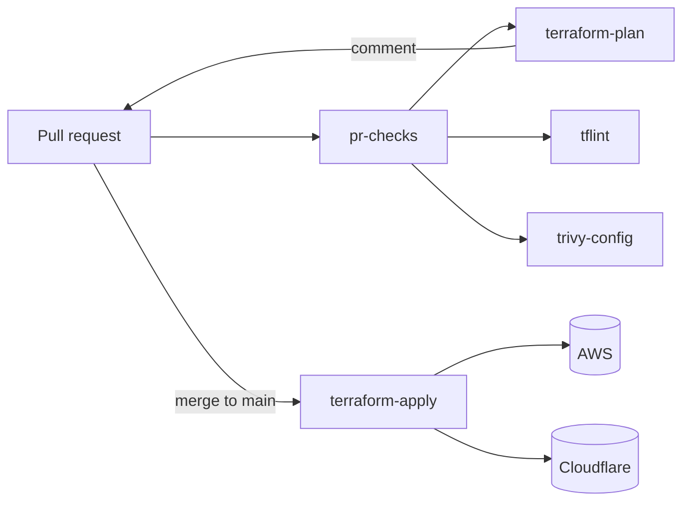
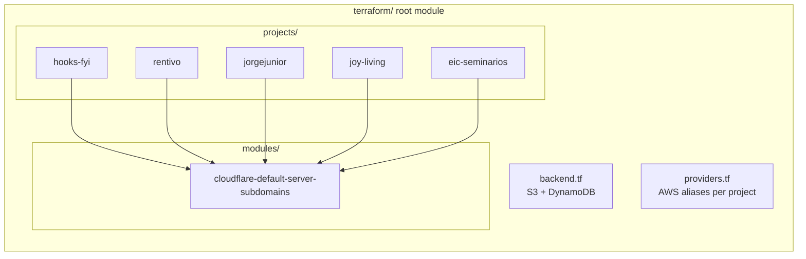

# Public-repo prep — Design

## Goal

Add the documentation and policy files needed to flip this repo to public, audit existing content for accidentally-leaked operational detail, and polish the README. No code or infrastructure changes.

## Information audit (already done at brainstorm time)

- **No secrets in git history.** Greps for `AKIA*`, `cf<37hex>`, `ghp_*`, private-key markers, `password=`/`api_token=` patterns return nothing. No `*.tfstate`, `*.tfvars`, `*.env*`, `credentials*`, or Pulumi config files were ever committed.
- **No hardcoded IPs.** Origin IPs flow through `var.server_ipv4` / `var.server_ipv6`, sourced from `TF_VAR_*` in CI.
- **No hardcoded account IDs.** AWS account ID never referenced; Cloudflare account ID was removed in PR-2 of the polish series.
- **What viewers will see** is the deployed-domain portfolio, customer project names (`rentivo`, `joy-living`, `eic-seminarios`), bucket/IAM names, the state backend bucket name, AWS region, and the SES sender address — all already public via DNS, CT logs, or trivially derivable. Customer-naming was explicitly approved (Q1 = keep).

## Non-goals

- Renaming/anonymizing customer project module directories.
- Renaming any AWS resource (bucket, IAM user, policy).
- Migrating from long-lived AWS access keys to GitHub OIDC.
- Cloudflare provider 4.x → 5.x bump.
- Adding banner art, hero image, or animated GIFs.

## Constraints

- No terraform plan should change as a result of this work — every PR is docs/policy only.
- All new top-level files conform to GitHub's expected naming so they get rendered in the right places (`LICENSE`, `SECURITY.md`, `CONTRIBUTING.md`).
- README and ARCHITECTURE updates remain Markdown-only; Mermaid renders natively on GitHub.

---

## Section 1 — License

### Choice

MIT, copyright `2026 Jorge Junior`.

### File

`LICENSE` at repo root, standard MIT text. Year matches the repo's first commit year.

```
MIT License

Copyright (c) 2026 Jorge Junior

Permission is hereby granted, free of charge, …
```

(Full standard text, no modifications.)

### Implication

Anyone may fork, copy, modify, and redistribute the IaC code with attribution. Customer-named modules are, by extension, also MIT-licensed code — but the deployed *services* and *domains* are not the licensed thing; only the Terraform config is.

---

## Section 2 — Security policy

### File

`SECURITY.md` at repo root.

### Content

Short and direct. Covers:

- **What's in scope:** the Terraform code, CI workflows, scripts in this repo.
- **What's not in scope:** the deployed services (rentivo, hooks-fyi, etc.). Reports about those go to the project owners directly.
- **How to report:** GitHub private security advisory (preferred) → fall back to direct email to the maintainer if GHSAs aren't enabled. No public issues for security bugs.
- **Response expectation:** acknowledgement within 7 days, fix or rationale within 30 days. Best-effort — this is a personal infra repo, not a funded program.
- **Scope examples that ARE valid security findings:** committed-secret discovery in history, mis-permissive IAM policy, mis-configured S3 bucket, CI workflow injection, dependency vuln in a hook/action.
- **NOT in scope:** general code-quality issues (use a regular issue/PR), DNS hijacking of someone else's zone (report to that owner), SES abuse from another sender.

### File length

~50 lines. No GPG key block (overkill); no bug-bounty mention (none on offer).

---

## Section 3 — Contributing guide

### File

`CONTRIBUTING.md` at repo root.

### Content

- **Pre-flight (recommended):** `pre-commit install` so fmt/validate/tflint run locally.
- **Workflow:**
  1. Fork.
  2. Branch off `main`.
  3. Make the change inside `terraform/` (and/or workflows).
  4. Run `terraform fmt -recursive` and ensure `tflint --recursive` passes.
  5. Open a PR. CI runs `terraform-plan`, `tflint`, `trivy-config`.
  6. The plan PR comment shows what will change. Reviewer (the maintainer) reads it before merge.
  7. Merge to `main` triggers apply.
- **Plan must be a no-op for non-functional changes** (refactors, doc updates, CI tweaks). Code that changes deployed state needs explicit description and reviewer sign-off.
- **What contributors should NOT submit:**
  - Changes to *another* project's resources without coordinating with the owner.
  - Renaming AWS resources (bucket / IAM user / policy names) — these are tied to live state and require migration.
  - Removing the customer-named project modules.
- **Commit-message convention:** Conventional Commits (`feat:`, `fix:`, `chore:`, `ci:`, `docs:`, `refactor:`).
- **Local development environment:** Terraform `1.10.5` (matches `.tool-versions`). Docker fallback: `docker run --rm -v $PWD:/work -w /work/terraform hashicorp/terraform:1.10.5 <cmd>`.

### File length

~60–80 lines. Functional, not aspirational.

---

## Section 4 — README polish

### Diff against current README

Current README is already concise (40 lines). Changes:

1. **Tagline** below the H1: one-line description of what this repo is and who it serves.
2. **Badges row** immediately under the tagline:
   - CI status: `https://img.shields.io/github/actions/workflow/status/jorgejr568/infra-resources/pr-checks.yml?branch=main&label=pr-checks`
   - License: `https://img.shields.io/github/license/jorgejr568/infra-resources`
   - Terraform: `https://img.shields.io/badge/terraform-1.10.5-blueviolet`
3. **Mermaid diagram** in a new `## Architecture at a glance` section between Quick start and Local development. Renders the PR-and-apply flow plus the resource shape per project. ~25 lines of Mermaid source.
4. **Existing sections** (Quick start, Local development, Layout) stay essentially as-is.

### Mermaid diagram (sample, will be tightened during writing)

Two-graph approach:





The second diagram conveys "shared primitive module" without forcing the viewer to read ARCHITECTURE.md.

### Don't

- No banner image, no logo, no animated gif.
- No Table of Contents (the README is too short to warrant one).
- No badge bloat — three badges max.

---

## Section 5 — Audit of existing planning docs

### Files in `docs/superpowers/plans/`

- `2026-04-29-aws-resources-bootstrap.md`
- `2026-04-30-cutover-runbook.md`
- `2026-04-30-port-cloudflare-to-terraform.md`
- `2026-05-02-polish-repo.md`

These are historical implementation plans from earlier work. They are likely descriptive (steps, file names) rather than state-bearing (no IDs/secrets), but a public-eye scan is required before publishing.

### Audit procedure

For each file, scan for:

- AWS account IDs (12-digit)
- Cloudflare account/zone IDs (32-hex)
- Specific access-key prefixes (`AKIA…`, `ASIA…`)
- Real IP addresses (any `\d{1,3}\.\d{1,3}\.\d{1,3}\.\d{1,3}` not annotated as "example")
- Real email addresses other than the maintainer's commit-history email
- Anything labelled "secret", "token", "password", or "key" with a literal value

### Action

- If clean: leave the file unchanged, tick it off.
- If a leaky value is found: redact in-place, replacing with `<redacted>` plus a comment noting the redaction date. Do *not* rewrite git history (would orphan signed commits and isn't worth the cost for a low-severity disclosure).

This step happens *before* the repo flips public.

---

## Section 6 — Out-of-scope follow-ups (mention only)

Captured here so they're visible but not bundled into this PR set:

- Code of Conduct file (Q3 = (b), explicitly excluded).
- GitHub issue / PR templates (Q3 = (b), explicitly excluded).
- CODEOWNERS (Q3 = (b), explicitly excluded).
- Repo description / topics on GitHub (settings, not code).
- Branch protection rules (settings, not code).

---

## Sequencing

One PR per logical concern, in this order. Each is small:

1. **PR A — License.** Add `LICENSE`. ~25 lines.
2. **PR B — Security policy.** Add `SECURITY.md`. ~50 lines.
3. **PR C — Contributing guide.** Add `CONTRIBUTING.md`. ~80 lines.
4. **PR D — README badges + Mermaid + tagline.** Edit `README.md`. ~30 lines added.
5. **PR E — Plans audit.** Verify and (if needed) redact `docs/superpowers/plans/*`. May be a no-op merge.

If audit (PR E) finds anything that warrants concern, it surfaces *before* the repo flips public — a hard gate.

## Testing

- **PR A–E:** CI plan job stays green or skipped (paths-filter: only PR D and PR E touch outside `terraform/**` / workflow files; only PR D may not even trigger terraform-plan since it's docs-only).
- **PR D specifically:** verify the rendered README on the GitHub PR diff view shows badges and the Mermaid diagrams as rendered images, not raw source.
- **Post-merge of PR E:** repo is ready to flip public. Final manual gate: maintainer reads each new file end-to-end before clicking "Make public" in GitHub settings.

## Risks

- **Mermaid rendering quirks** — GitHub's Mermaid is mostly stable but sometimes regresses. If a diagram fails to render, fall back to a static text rendering of the same content; do not block the PR.
- **License year mismatch** — if the maintainer prefers a different copyright year (e.g. tracking initial publication year vs. fork year), edit the LICENSE during PR A review.
- **SECURITY.md GHSA precondition** — GitHub private security advisories must be enabled in repo settings before SECURITY.md's instructions apply. Maintainer enables this manually before the public flip.
